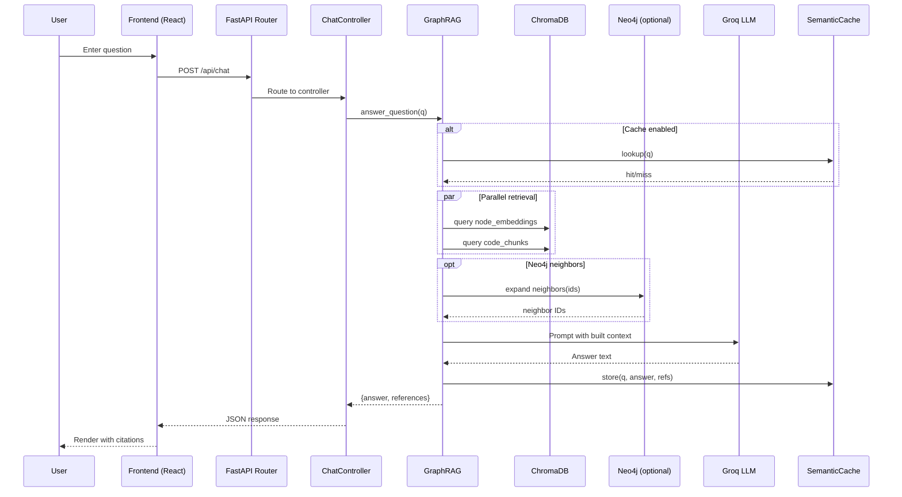
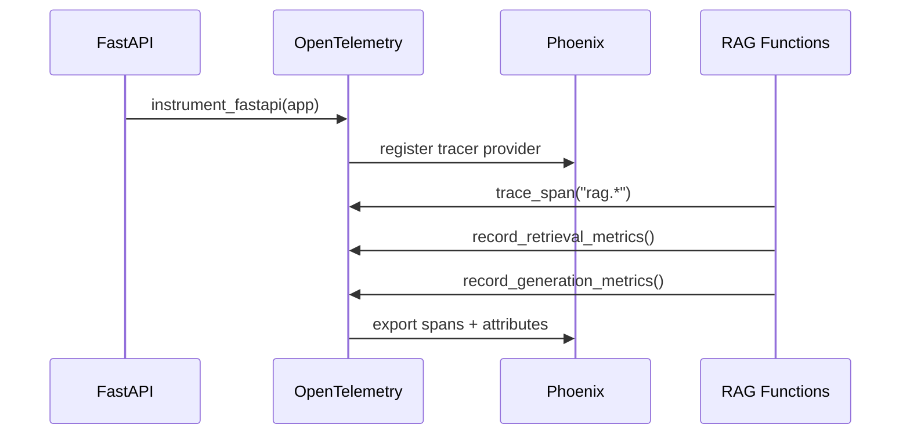
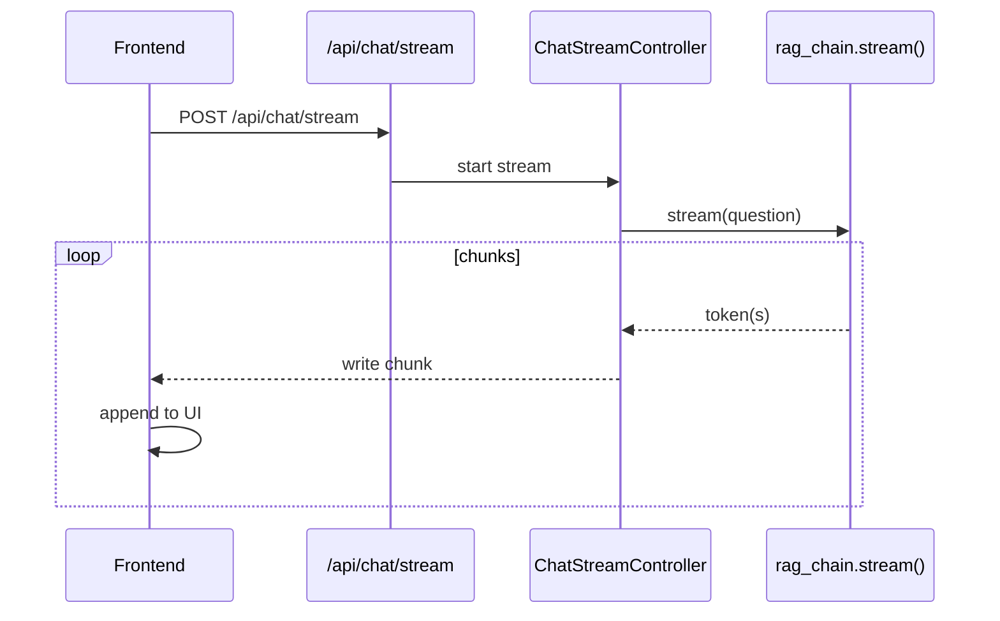

# <p align="center">CELERGRAPH.</p>

<p align="center">
  
</p>


This guide documents the complete workflow for setting up and running the Knowledge Graph RAG (Retrieval-Augmented Generation) system.

## Quick Setup (Virtual Environment)

Use a Python virtual environment to isolate dependencies.

### Create and Activate (Windows PowerShell)

```bash
# From project root
python -m venv venv
.\venv\\Scripts\\Activate.ps1

# Upgrade pip
python -m pip install --upgrade pip
```

### Install Dependencies

```bash
# If requirements.txt is present
pip install -r requirements.txt

# Otherwise install packages manually (example)
# pip install fastapi uvicorn chromadb sentence-transformers neo4j langchain_groq python-dotenv opentelemetry-sdk arize-phoenix
```

### Deactivate

```bash
deactivate
```

## System Architecture

The system consists of three main services:
- **Vue.js Frontend**: User interface for chat interactions
- **FastAPI Backend**: RAG API with knowledge graph integration  
- **Phoenix Observability**: Tracing and monitoring dashboard

## Service URLs

| Service | Port | URL | Purpose |
|--------|------|-----|---------|
| Vue.js Frontend | 5173 | http://localhost:5173 | Chat interface |
| FastAPI Backend | 8000 | http://localhost:8000 | RAG API server |
| FastAPI Docs | 8000 | http://localhost:8000/docs | API documentation |
| Phoenix Tracing | 6006 | http://localhost:6006 | Observability dashboard |

## Knowledge Graph Pipeline Execution Order

### 1. Create and Activate Virtual Environment
See Quick Setup above.

### 2. Install Dependencies
Install packages from `requirements.txt` (or manually).

### 3. Generate Knowledge Graph JSON from Codebase
Extract the knowledge graph from Python files and save as JSON.
```bash
cd graph_indexing/kgbuild
python runner.py <path_to_codebase>
```
**Default output**: `graph_indexing/knowledge_graph.json`

### 4. Load Knowledge Graph into Neo4j Database  
Load the JSON knowledge graph into Neo4j with Cypher queries.
```bash
cd core
python loadneo.py
```
**Note**: Requires Neo4j database connection configured in `config/myapikeys.py`

### 5. Embed Knowledge Graph Nodes into ChromaDB
Convert KG nodes to embeddings for semantic search.
```bash
cd core
python embed_nodes.py graph_indexing/knowledge_graph.json
```
**Collection**: `node_embeddings` in ChromaDB

### 6. Ingest Code Chunks into ChromaDB
Process Python files and create searchable code chunks.
```bash
cd core
python chunker.py
```
**Collection**: `code_chunks` in ChromaDB


**Or**: Run individual steps above for more control

## Starting the Application

### Option A: Start All Services Together
```bash
# From project root
python run_all.bat
```

### Option B: Start Services Individually
```bash
# Backend (FastAPI)
cd api
python main.py

# Frontend (Vue.js)  
cd frontend
npm run dev

# Phoenix (Observability)
# Phoenix starts automatically with run_all.bat
# Or manually: phoenix serve
```

## API Endpoints

The FastAPI backend exposes the following documented endpoints. Visit `http://localhost:8000/docs` (Swagger UI) or `http://localhost:8000/redoc` (ReDoc) for interactive documentation. The raw OpenAPI spec is available at `http://localhost:8000/openapi.json`.

- `POST /api/chat` — Generate an answer with RAG
  - Request body (example):
    ```json
    {
      "message": "How does routing work?",
      "max_tokens": 800,
      "temperature": 0.2,
      "bypass_cache": false
    }
    ```
  - Response body (example):
    ```json
    {
      "answer": "...formatted answer with references...",
      "references": ["[node:...]"]
    }
    ```
  - cURL:
    ```bash
    curl -sS http://localhost:8000/api/chat \
      -H "Content-Type: application/json" \
      -d '{
        "message": "How does routing work?",
        "max_tokens": 800,
        "temperature": 0.2,
        "bypass_cache": false
      }'
    ```

- `POST /api/chat/stream` — Stream the RAG answer
  - Request body (example):
    ```json
    {
      "message": "Walk me through the GraphRAG pipeline",
      "max_tokens": 1200
    }
    ```
  - Returns a streaming text response (ND‑text) as tokens are generated.

- `POST /api/index` — Chunk + embed Python files under a folder
  - Request body (example):
    ```json
    {
      "path": "infos",
      "rebuild": false
    }
    ```
  - Response body (example):
    ```json
    {
      "indexed_files": ["infos/applications.py", "infos/routing.py"],
      "chunks_processed": 123
    }
    ```

- `POST /api/cache/clear` — Clear semantic cache
  - Response body (example):
    ```json
    { "status": "ok", "cleared": true }
    ```

- `GET /api/health` — Health and readiness
  - Response body (example):
    ```json
    {
      "status": "ok",
      "vector_db_status": "ready",
      "graph_status": "connected"
    }
    ```

- `GET /api/history` — Retrieve chat history
  - Response body: Array of stored history items.

- `POST /api/history` — Add a chat history item
  - Request body (example): `{ "id": 1700000000000, "title": "Question", "date": "Today" }`

Note: the `/metrics` endpoint is not part of this API; tracing and metrics are provided via Phoenix (see Observability) and OTEL span attributes.

## Environment Configuration

Key configuration files:
- `.env` - Main environment variables
- `config/myapikeys.py` - API keys and database connections
- `config/settings.py` - Application settings

### Neo4j Aura Credentials

Use Neo4j Aura (managed cloud) to provision credentials for graph features.

1. Sign in at https://console.neo4j.io and create a new Aura database.
2. Choose a region and size; wait for provisioning to complete.
3. Click “Connect” and copy the connection URI (look for `neo4j+s://...`).
4. Set credentials in your `.env`:
   ```bash
   NEO4J_URI=neo4j+s://<your-endpoint>
   NEO4J_USERNAME=neo4j
   NEO4J_PASSWORD=<your-generated-password>
   USE_NEO4J=true
   ```
5. Ensure your IP/network can reach Aura (it’s public over TLS).
6. Optional: test connectivity in Python:
   ```python
   from neo4j import GraphDatabase
   driver = GraphDatabase.driver(
       os.getenv("NEO4J_URI"),
       auth=(os.getenv("NEO4J_USERNAME"), os.getenv("NEO4J_PASSWORD")),
   )
   driver.verify_connectivity()
   driver.close()
   ```

Notes:
- The importer in `core/loadneo.py` uses `apoc.create.relationship`. Aura includes APOC Core; if your plan lacks that procedure, replace with standard `MERGE` relationship creation.
- The SOLID pipeline respects `USE_NEO4J` via env (`config/settings.py`). The LCEL pipeline toggles Neo4j neighbors with a code flag in `core/graphrag.py`.

## Troubleshooting

### Common Issues

1. **"str object has no attribute 'get'" error**
   - Ensure backend is restarted after code changes: `python run_all.bat`
   - Check that all services are running on correct ports

2. **ChromaDB connection errors**
   - Verify `CHROMA_PATH` environment variable is set
   - Check vector store directory permissions

3. **Neo4j connection errors**
   - Verify Neo4j credentials in `config/myapikeys.py`
   - Ensure Neo4j service is running

### Logs and Monitoring

- Application logs: Check console output
- Phoenix tracing: http://localhost:6006
- Metrics: http://localhost:8000/metrics

## Development Workflow

1. **Modify knowledge graph extraction**: Edit `graph_indexing/kgbuild/`
2. **Change RAG logic**: Edit `core/graphrag.py`
3. **Update API**: Edit `api/controllers.py`
4. **Frontend changes**: Edit `frontend/src/`

## Next Steps

- Customize the knowledge graph extraction for your specific codebase
- Adjust RAG parameters in `core/graphrag.py`
- Add new API endpoints in `api/routes.py`
- Extend the frontend UI in `frontend/src/GraphRAGChat.jsx`
## Architecture Diagrams

### System Overview

<p align="center">
  
</p>

### Overall Components

```mermaid
graph TD
  FE[Frontend (Vite/React)] -- HTTP --> API[FastAPI API]
  API -- CORS + RateLimit --> MW[Middlewares]
  API -- OpenAPI --> Docs[Swagger/ReDoc]
  API --> Ctrl[Controllers]
  Ctrl --> RAG[GraphRAG Pipeline]
  RAG --> CH[ChromaDB]
  RAG -. optional .-> N4J[Neo4j]
  RAG --> LLM[Groq LLM]
  RAG --> Cache[Semantic Cache]
  Obs[Phoenix + OTEL] <-- Spans/Metrics --> API
  Obs <-- Spans/Metrics --> RAG
  subgraph Storage
    CH
    Cache
  end
```

### RAG Request Flow



### Knowledge Graph Build Pipeline

```mermaid
flowchart LR
  SRC[Python source files] --> CST[LibCST parse]
  CST --> EX[PyExtract visitor]
  EX --> KGNodes[Nodes: module/class/function]
  EX --> KGEdges[Edges: CONTAINS/CALLS/IMPORTS/INHERITS]
  KGNodes --> JSON[knowledge_graph.json]
  KGEdges --> JSON
  TS[Tree-sitter (optional)] --> KGNodes
  JSON -->|batch import| N4J[(Neo4j)]
```

### Data Stores (Chroma Collections)


### Observability / Tracing



### Streaming Chat Flow


