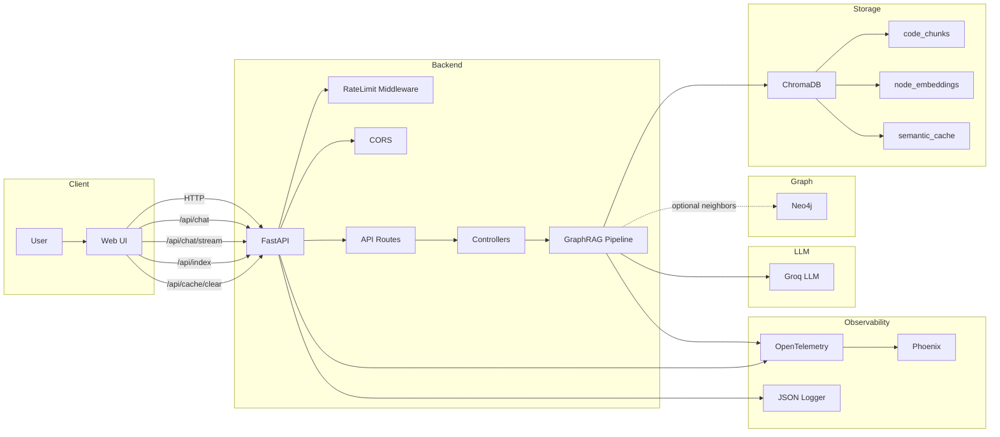
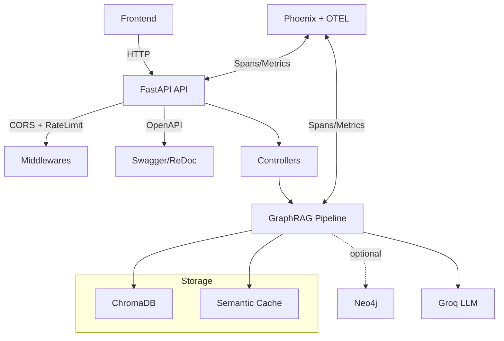
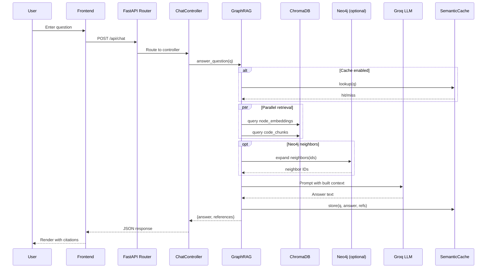
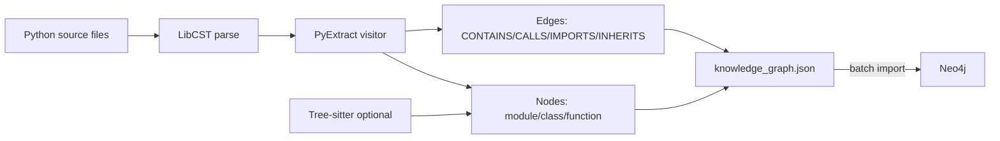
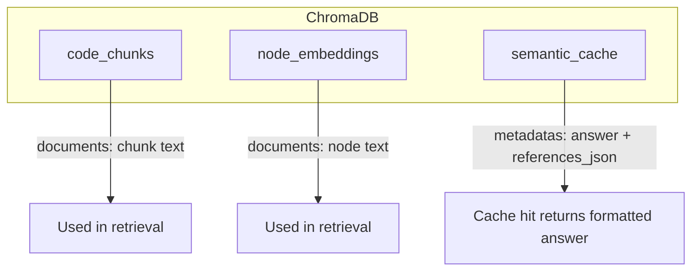
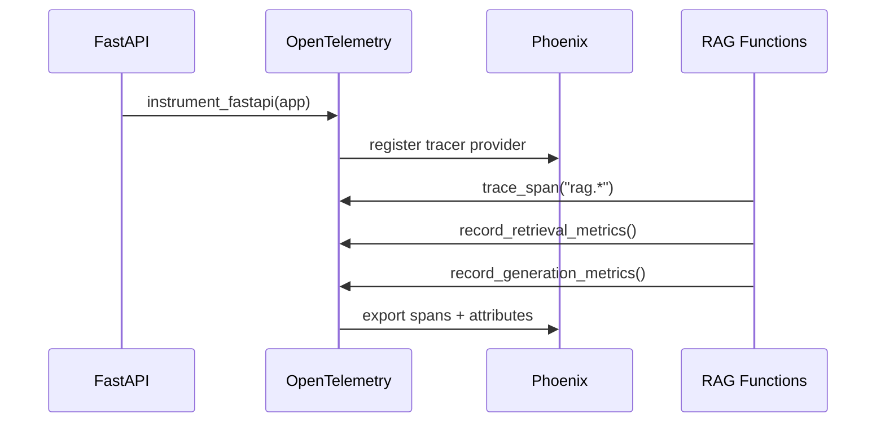
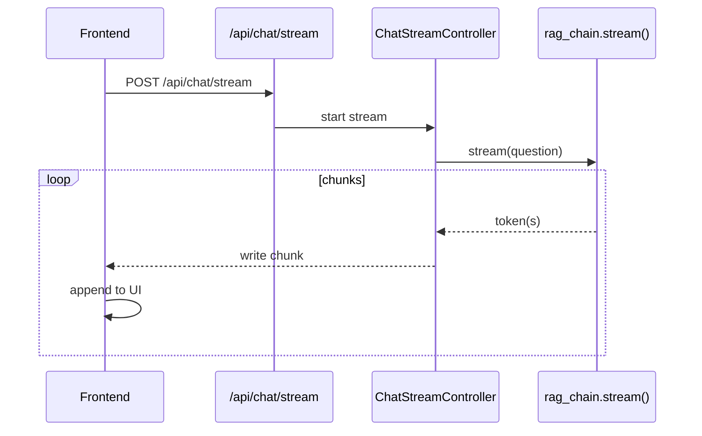

# CelerGraph Documentation

This guide documents the complete workflow for setting up and running the Knowledge Graph RAG (Retrieval-Augmented Generation) system.

**Python Compatibility**: This stack is best compatible with Python 3.10 (recommended) and Python 3.11.

---

## What is CelerGraph?

CelerGraph is a GraphRAG (Graph-based Retrieval-Augmented Generation) system built to understand and query codebases intelligently. It combines knowledge graph technology with vector embeddings to provide accurate, context-aware answers about code structure, relationships, and functionality.

### Built on FastAPI Core Codebase
This implementation uses the FastAPI framework codebase as its primary knowledge source, demonstrating how GraphRAG can extract and navigate:
- Module structures and dependencies
- Class hierarchies and inheritance relationships  
- Function call chains and import graphs
- Code semantics through natural language queries

### How It Works
1. Extracts a knowledge graph from Python source code (modules, classes, functions, their relationships)
2. Embeds code chunks and graph nodes into a vector database for semantic search
3. Retrieves relevant context by combining vector similarity search with graph traversal
4. Generates answers using an LLM (gpt-oss-120b) with retrieved context and graph relationships
5. Caches semantically similar queries to reduce latency and API costs

### Use Cases
- "How does FastAPI handle request routing?"
- "Show me all classes that inherit from BaseModel"
- "What functions call the dependency injection system?"
- "Explain the middleware execution order"

The system can be adapted to any Python codebase, making it a powerful tool for code exploration, onboarding, and documentation.

**Testing the RAG**: A curated set of sample questions is available in `samplequestions.txt` to help you test the system's capabilities and understand the types of queries it handles well.

---

## Training Dataset: FastAPI Core

### Dataset Source
The knowledge graph and embeddings are built from the core `fastapi/` package folder, specifically curated to include only the most relevant and architecturally significant modules. Not all files were included - only those essential for understanding FastAPI's core functionality, routing, dependency injection, and request/response handling.

### Selected Training Files

**Folders**
- `dependencies/` - Dependency injection internals (resolution, caching, scopes)
- `openapi/` - OpenAPI schema generation utilities

**Core Modules**
- `__init__.py` - Package initializer and public API surface
- `applications.py` - FastAPI class and ASGI app construction
- `background.py` - Background task primitives (BackgroundTask, BackgroundTasks)
- `concurrency.py` - Sync/async bridging utilities (run_in_threadpool, iterate_in_threadpool)
- `datastructures.py` - Custom data containers for request/response handling
- `encoders.py` - JSON serialization helpers (jsonable_encoder)
- `exception_handlers.py` - Default exception-to-HTTP response mapping
- `exceptions.py` - Framework-specific exception classes
- `param_functions.py` - Parameter factory functions (Query, Path, Body, Depends, Security)
- `params.py` - Parameter metadata classes with validation rules
- `responses.py` - HTTP response utilities and classes
- `routing.py` - APIRoute/APIRouter implementation and endpoint wiring
- `temp_pydantic_v1_params.py` - Pydantic v1 compatibility shims
- `testclient.py` - Test client wrapper for FastAPI applications
- `types.py` - Shared type aliases across the package
- `utils.py` - General utilities (route naming, metadata merging, helpers)

### Excluded Files
The following were intentionally excluded as they are either wrappers, minimal utilities, or non-core functionality:
- `__main__.py` - Minimal CLI entrypoint
- `cli.py` - Command-line helpers (minimal content)
- `logger.py` - Tiny logging configuration
- `requests.py` - Thin re-export of Starlette Request
- `staticfiles.py` - Static file serving wrapper
- `templating.py` - Jinja2 templating wrapper
- `websockets.py` - WebSocket support wrapper
- `_compat/` folder - Version compatibility shims
- `middleware/` folder - Middleware adapters (placeholder)
- `security/` folder - Auth/security helpers (placeholder in snapshot)
- `py.typed` - PEP-561 marker file

### Rationale
This selection focuses on FastAPI's core architecture, routing mechanisms, dependency injection system, and request/response lifecycle. These are the foundational components that developers most frequently need to understand. Excluded files are either thin wrappers around Starlette functionality or auxiliary features that don't represent core design patterns.

---

## Key Python Packages

### Core RAG and LLM
- **langchain** (1.0.8) - Framework for building LLM applications with RAG pipelines
- **langchain-groq** (1.0.1) - Groq LLM integration for fast inference
- **langchain-community** (0.4.1) - Community-contributed LangChain integrations
- **sentence-transformers** (5.1.2) - Generate semantic embeddings for text similarity
- **LLM Model**: gpt-oss-120b (via Groq Cloud) - Large open-source instruction-tuned model for generation
- **Embedding Model**: BAAI/bge-small-en-v1.5 - Lightweight 384-dim embeddings for semantic search

### Vector Storage and Retrieval
- **chromadb** (1.3.5) - Embedded vector database for semantic search
- **neo4j** (6.0.3) - Graph database driver for knowledge graph storage

### Knowledge Graph Extraction
- **libcst** (1.8.6) - Concrete syntax tree parser for Python code analysis
- **tree-sitter** (0.25.2) - Fast incremental parser for extracting code structure
- **tree-sitter-languages** (1.10.2) - Language grammars for tree-sitter

### API and Web Framework
- **fastapi** (0.121.3) - High-performance async web framework for building APIs
- **uvicorn** (0.38.0) - ASGI server for running FastAPI applications
- **pydantic** (2.12.4) - Data validation and settings management using Python type annotations
- **pydantic-settings** (2.12.0) - Environment variable and config management for Pydantic models

### Observability and Monitoring
- **arize-phoenix** (12.17.0) - LLM observability platform for tracing and debugging
- **opentelemetry-sdk** (1.38.0) - OpenTelemetry implementation for distributed tracing
- **opentelemetry-instrumentation-fastapi** (0.59b0) - Auto-instrumentation for FastAPI apps

### Data Processing
- **pandas** (2.3.3) - Data manipulation and analysis library
- **numpy** (1.26.4) - Numerical computing with multidimensional arrays
- **torch** (2.9.1) - PyTorch deep learning framework for embeddings

### Code Quality and Linting
- **ruff** (0.14.6) - Extremely fast Python linter and code formatter (replaces Flake8, Black, isort)
- **mypy** (1.18.2) - Static type checker for Python to catch type errors before runtime

---

## Design Patterns and Architecture Decisions

### 1. Repository Pattern (`core/retrieval.py`, `core/embeddings.py`)
**Why**: Abstracts data access logic for ChromaDB and Neo4j, making it easy to swap vector stores or graph databases without changing business logic. Enables clean separation between storage and application layers.

### 2. Factory Pattern (`core/services.py`)
**Why**: Centralizes creation of LLM clients, embedding models, and vector stores. Ensures consistent configuration and makes dependency injection straightforward for testing and observability.

### 3. Decorator Pattern (`observability/tracing/decorators.py`)
**Why**: Adds cross-cutting concerns like tracing, logging, and metrics without modifying core business logic. The `@trace_span` decorator instruments functions cleanly for Phoenix observability.

### 4. Strategy Pattern (`core/graphrag.py`)
**Why**: Allows switching between different RAG strategies (e.g., with/without Neo4j graph expansion, different retrieval methods) at runtime based on configuration flags like `USE_NEO4J`.

### 5. Pipeline Pattern (Knowledge Graph Build: `graph_indexing/kgbuild/`)
**Why**: Breaks down complex knowledge graph extraction into sequential stages (parse, extract, transform, load). Each stage is independently testable and can be replaced or enhanced.

### 6. Middleware Pattern (`api/main.py`)
**Why**: Separates concerns like CORS, rate limiting, and OpenTelemetry instrumentation from core API logic. Middleware runs before/after requests without cluttering route handlers.

### 7. Controller Pattern (`api/controllers.py`)
**Why**: Separates HTTP request/response handling from business logic. Controllers orchestrate services, validate input via Pydantic models, and format responses while keeping routes thin and testable.

### 8. Semantic Caching (`core/retrieval.py` - `semantic_cache` collection)
**Why**: Reduces LLM API costs and latency by caching semantically similar queries. Uses vector similarity instead of exact string matching, improving cache hit rates for paraphrased questions.

### 9. Dependency Injection (FastAPI's native DI)
**Why**: Makes services, database connections, and configuration injectable into route handlers. Simplifies testing with mocks and enables clean separation of concerns.

### 10. Observer Pattern (Phoenix + OpenTelemetry integration)
**Why**: Decouples observability from core logic. OpenTelemetry observers emit spans/metrics that Phoenix consumes, allowing monitoring to be added/removed without code changes.

### Key Architectural Principles
- **Separation of Concerns**: Clear boundaries between API, business logic, data access, and observability layers
- **Dependency Inversion**: High-level modules (controllers) depend on abstractions (interfaces), not concrete implementations
- **Single Responsibility**: Each module has one reason to change (e.g., `chunker.py` only handles document chunking)
- **Open/Closed Principle**: System is open for extension (new retrieval strategies) but closed for modification (existing code stays stable)

---

## Technology Selection and Trade-offs

### Design Philosophy
The project was built with a focus on simplicity, accessibility, and open-source tooling. The goal was to avoid complex containerization (Docker/WSL) and keep the setup as straightforward as possible using only pip-installable packages.

### Python Version: 3.10
**Why 3.10 specifically?** The LangChain ecosystem works most reliably with Python 3.10. While newer versions (3.11, 3.12+) offer performance improvements, they introduce compatibility issues with key LangChain dependencies, vector stores, and embedding libraries.

### Knowledge Graph Extraction: tree-sitter + libcst
Before settling on this combination, several alternatives were evaluated:

**Bevel Software Framework**
- Pros: Purpose-built for code analysis and knowledge graph extraction
- Cons: PyPI version deprecated; current version rewritten in Rust (not pip-installable)
- Decision: Incompatible with our Python-only, pip-friendly requirement

**GraphSitter by Codegen**
- Pros: Direct codebase to Neo4j visualization; elegant single-step solution
- Cons: Requires Python 3.12+ which conflicts with LangChain's optimal runtime (Python 3.10)
- Decision: Version compatibility issues would introduce fragility across the entire stack

**tree-sitter + libcst (Final Choice)**
- Pros: 
  - Both pip-installable and well-maintained
  - Compatible with Python 3.10
  - tree-sitter handles fast incremental parsing
  - libcst provides full concrete syntax tree analysis
  - Complementary strengths (speed + detail)
- Cons: Requires custom extraction logic in `graph_indexing/kgbuild/`
- Decision: Worth the implementation effort for stability and compatibility

### No Docker/WSL Requirement
All services (FastAPI, ChromaDB, Phoenix) run natively on Windows/Linux/macOS without containers. This reduces setup friction and makes the system more accessible for development and experimentation.

---

## Known Limitations and Constraints

### 1. Python Version Dependency
- **Limitation**: Locked to Python 3.10 for LangChain compatibility
- **Impact**: Cannot leverage performance improvements in Python 3.11+ (faster startup, better error messages)
- **Workaround**: Monitor LangChain updates for future Python 3.11/3.12 support

### 2. Code Analysis Scope
- **Limitation**: tree-sitter and libcst only parse Python syntax; don't understand runtime behavior
- **Impact**: 
  - Cannot detect dynamic imports, eval(), or runtime-generated code
  - Misses relationships established through metaprogramming or decorators
  - May not capture all call relationships in highly dynamic codebases
- **Workaround**: Manual annotation or hybrid static+dynamic analysis for critical paths

### 3. Embedding Model Constraints
- **Limitation**: BAAI/bge-small-en-v1.5 generates 384-dimensional embeddings
- **Impact**: 
  - Lower dimensionality than larger models (e.g., OpenAI ada-002: 1536-dim)
  - May miss nuanced semantic relationships in highly technical or domain-specific code
  - English-only; limited multilingual support
- **Workaround**: Can swap for bge-large-en-v1.5 (1024-dim) or multilingual variants at the cost of speed

### 4. LLM Context Window
- **Limitation**: gpt-oss-120b context window size limits retrieved context
- **Impact**: 
  - Cannot fit entire large codebases in a single query
  - May truncate retrieved context if too many chunks/nodes are returned
  - Long conversations may lose early context
- **Workaround**: Implement sliding window context management or hierarchical summarization

### 5. ChromaDB Scalability
- **Limitation**: Embedded ChromaDB not optimized for multi-user production workloads
- **Impact**:
  - Single-threaded writes may bottleneck during bulk indexing
  - No built-in clustering or horizontal scaling
  - Limited to single-machine memory constraints
- **Workaround**: Migrate to ChromaDB client-server mode or consider Pinecone/Weaviate for production

### 6. Neo4j Aura Free Tier Constraints
- **Limitation**: Free tier has storage limits (around 200MB) and connection restrictions
- **Impact**:
  - Large codebases may exceed storage quota
  - Concurrent connection limits for multi-user scenarios
  - Requires internet connectivity (cloud-only)
- **Workaround**: Use Neo4j Desktop for local development or upgrade to paid tier

### 7. Semantic Cache False Positives
- **Limitation**: Vector similarity-based caching may return cached answers for semantically similar but contextually different queries
- **Impact**:
  - "What is function X?" vs "Why was function X deprecated?" might hit same cache
  - Cache invalidation difficult when underlying codebase changes
- **Workaround**: Lower similarity threshold or implement cache versioning tied to codebase commits

### 8. Graph Traversal Depth
- **Limitation**: Neo4j neighbor expansion is depth-limited (default: 2 hops)
- **Impact**:
  - May miss distant but relevant relationships in large codebases
  - Deep call chains or inheritance hierarchies might be incomplete
- **Workaround**: Configurable depth parameter, but performance degrades exponentially with depth

### 9. Real-time Code Sync
- **Limitation**: No automatic detection of codebase changes; requires manual re-indexing
- **Impact**:
  - Stale answers if code changes after indexing
  - No incremental updates; full re-indexing required
- **Workaround**: Implement file watchers or webhook-based re-indexing pipeline

### 10. API Rate Limiting
- **Limitation**: Groq Cloud API has rate limits (requests per minute/day)
- **Impact**:
  - Burst queries may hit rate limits during peak usage
  - Free tier restrictions on concurrent requests
- **Workaround**: Implement request queuing, retry logic (tenacity), or upgrade to paid tier

### 11. Observability Storage
- **Limitation**: Phoenix stores traces in-memory by default
- **Impact**:
  - Trace data lost on restart
  - Limited historical analysis capabilities
  - Memory usage grows with trace volume
- **Workaround**: Configure Phoenix to export to persistent backends (e.g., PostgreSQL, S3)

### 12. Single-Language Support
- **Limitation**: Knowledge graph extraction targets Python codebases only
- **Impact**: Cannot analyze polyglot repositories (JavaScript, Java, Go, etc.)
- **Workaround**: Extend extraction pipeline with tree-sitter grammars for other languages

### 13. No Authentication/Authorization
- **Limitation**: API endpoints lack built-in auth
- **Impact**: 
  - Unsuitable for multi-tenant or production deployments without additional security
  - No user-specific chat history isolation
- **Workaround**: Add FastAPI middleware for OAuth2/JWT authentication

### 14. Streaming Limitations
- **Limitation**: `/api/chat/stream` streams tokens but not intermediate retrieval steps
- **Impact**: User sees generation in real-time but not what context is being retrieved
- **Workaround**: Enhance streaming to include retrieval progress events

---

## Quick Start

### Service URLs
| Service | Port | URL | Purpose |
|--------|------|-----|---------|
| FastAPI Backend | 8000 | http://localhost:8000 | RAG API server |
| FastAPI Docs | 8000 | http://localhost:8000/docs | API documentation |
| Vue.js Frontend | 5173 | http://localhost:5173 | Chat interface |
| Phoenix Tracing | 6006 | http://localhost:6006 | Observability dashboard |

### Starting the Application

**Option A: Start All Services Together (Recommended)**
```bash
# From project root
python run_all.bat
```

**Option B: Start Services Individually**
```bash
# Backend (FastAPI)
cd api
python main.py

# Frontend (Vue.js)  
cd frontend
npm run dev

# Phoenix (Observability)
# Phoenix starts automatically with run_all.bat
# Or manually: phoenix serve
```

---

## Installation and Setup

### 1. Create Virtual Environment
Use a Python virtual environment to isolate dependencies.

```bash
# From project root (Windows PowerShell)
python -m venv venv
.\venv\Scripts\Activate.ps1

# Upgrade pip
python -m pip install --upgrade pip
```

### 2. Install Dependencies
```bash
# Install from requirements.txt
pip install -r requirements.txt
```

### 3. Deactivate (when done)
```bash
deactivate
```

---

## Environment Configuration

### Required Configuration Files
- `.env` - Main environment variables
- `config/myapikeys.py` - API keys and database connections
- `config/settings.py` - Application settings

### Neo4j Aura Credentials Setup

Use Neo4j Aura (managed cloud) to provision credentials for graph features.

1. Sign in at https://console.neo4j.io and create a new Aura database
2. Choose a region and size; wait for provisioning to complete
3. Click "Connect" and copy the connection URI (look for `neo4j+s://...`)
4. Set credentials in your `.env`:
   ```bash
   NEO4J_URI=neo4j+s://<your-endpoint>
   NEO4J_USERNAME=neo4j
   NEO4J_PASSWORD=<your-generated-password>
   USE_NEO4J=true
   ```
5. Ensure your IP/network can reach Aura (it's public over TLS)
6. Optional: test connectivity in Python:
   ```python
   from neo4j import GraphDatabase
   driver = GraphDatabase.driver(
       os.getenv("NEO4J_URI"),
       auth=(os.getenv("NEO4J_USERNAME"), os.getenv("NEO4J_PASSWORD")),
   )
   driver.verify_connectivity()
   driver.close()
   ```

**Notes:**
- The importer in `core/loadneo.py` uses `apoc.create.relationship`. Aura includes APOC Core; if your plan lacks that procedure, replace with standard `MERGE` relationship creation.
- The SOLID pipeline respects `USE_NEO4J` via env (`config/settings.py`). The LCEL pipeline toggles Neo4j neighbors with a code flag in `core/graphrag.py`.

---

## Knowledge Graph Pipeline Execution

Execute these steps in order to build and index your knowledge graph:

### 1. Generate Knowledge Graph JSON from Codebase
Extract the knowledge graph from Python files and save as JSON.
```bash
cd graph_indexing/kgbuild
python runner.py <path_to_codebase>
```
**Default output**: `graph_indexing/knowledge_graph.json`

### 2. Load Knowledge Graph into Neo4j Database  
Load the JSON knowledge graph into Neo4j with Cypher queries.
```bash
cd core
python loadneo.py
```
**Note**: Requires Neo4j database connection configured in `config/myapikeys.py`

### 3. Embed Knowledge Graph Nodes into ChromaDB
Convert KG nodes to embeddings for semantic search.
```bash
cd core
python embed_nodes.py graph_indexing/knowledge_graph.json
```
**Collection**: `node_embeddings` in ChromaDB

### 4. Ingest Code Chunks into ChromaDB
Process Python files and create searchable code chunks.
```bash
cd core
python chunker.py
```
**Collection**: `code_chunks` in ChromaDB

---

## API Endpoints

The FastAPI backend exposes the following documented endpoints. Visit `http://localhost:8000/docs` (Swagger UI) or `http://localhost:8000/redoc` (ReDoc) for interactive documentation. The raw OpenAPI spec is available at `http://localhost:8000/openapi.json`.

### POST /api/chat - Generate an answer with RAG
- **Request body** (example):
  ```json
  {
    "message": "How does routing work?",
    "max_tokens": 800,
    "temperature": 0.2,
    "bypass_cache": false
  }
  ```
- **Response body** (example):
  ```json
  {
    "answer": "...formatted answer with references...",
    "references": ["[node:...]"]
  }
  ```
- **cURL**:
  ```bash
  curl -sS http://localhost:8000/api/chat \
    -H "Content-Type: application/json" \
    -d '{
      "message": "How does routing work?",
      "max_tokens": 800,
      "temperature": 0.2,
      "bypass_cache": false
    }'
  ```

### POST /api/chat/stream - Stream the RAG answer
- **Request body** (example):
  ```json
  {
    "message": "Walk me through the GraphRAG pipeline",
    "max_tokens": 1200
  }
  ```
- Returns a streaming text response (ND-text) as tokens are generated

### POST /api/index - Chunk + embed Python files
- **Request body** (example):
  ```json
  {
    "path": "infos",
    "rebuild": false
  }
  ```
- **Response body** (example):
  ```json
  {
    "indexed_files": ["infos/applications.py", "infos/routing.py"],
    "chunks_processed": 123
  }
  ```

### POST /api/cache/clear - Clear semantic cache
- **Response body** (example):
  ```json
  { "status": "ok", "cleared": true }
  ```

### GET /api/health - Health and readiness
- **Response body** (example):
  ```json
  {
    "status": "ok",
    "vector_db_status": "ready",
    "graph_status": "connected"
  }
  ```

### GET /api/history - Retrieve chat history
- Response body: Array of stored history items

### POST /api/history - Add a chat history item
- **Request body** (example): 
  ```json
  { "id": 1700000000000, "title": "Question", "date": "Today" }
  ```

**Note**: The `/metrics` endpoint is not part of this API; tracing and metrics are provided via Phoenix (see Observability) and OTEL span attributes.

---

## Troubleshooting

### Common Issues

**1. "str object has no attribute 'get'" error**
- Ensure backend is restarted after code changes: `python run_all.bat`
- Check that all services are running on correct ports

**2. ChromaDB connection errors**
- Verify `CHROMA_PATH` environment variable is set
- Check vector store directory permissions

**3. Neo4j connection errors**
- Verify Neo4j credentials in `config/myapikeys.py`
- Ensure Neo4j service is running

### Logs and Monitoring
- Application logs: Check console output
- Phoenix tracing: http://localhost:6006
- Metrics: http://localhost:8000/metrics

---

## System Architecture

### System Overview
The system consists of three main services:
- **Vue.js Frontend**: User interface for chat interactions
- **FastAPI Backend**: RAG API with knowledge graph integration  
- **Phoenix Observability**: Tracing and monitoring dashboard

### Architecture Diagrams

#### System Overview Diagram


#### Overall Components


#### RAG Request Flow


#### Knowledge Graph Build Pipeline


#### Data Stores (Chroma Collections)


#### Observability / Tracing


#### Streaming Chat Flow


---

## Development Workflow

### Modify Components
1. **Modify knowledge graph extraction**: Edit `graph_indexing/kgbuild/`
2. **Change RAG logic**: Edit `core/graphrag.py`
3. **Update API**: Edit `api/controllers.py`
4. **Frontend changes**: Edit `frontend/src/`

### Next Steps
- Customize the knowledge graph extraction for your specific codebase
- Adjust RAG parameters in `core/graphrag.py`
- Add new API endpoints in `api/routes.py`
- Extend the frontend UI in `frontend/src/GraphRAGChat.jsx`

---

___

*This documentation was generated with assistance from AI. There are very slim chances of inconsistencies, please reach out to me in case you find one.*
